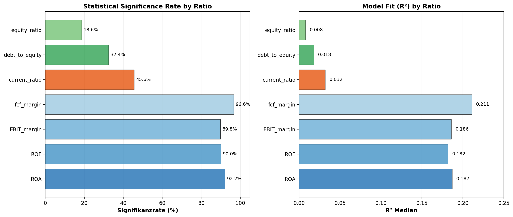

# 5 Ergebnisse FF1: Systematische Dynamikmuster von Finanzkennzahlen

Dieses Kapitel präsentiert den zentralen empirischen Befund der Arbeit: Die sieben untersuchten Finanzkennzahlen weisen eine konsistente Drei-Schichten-Hierarchie der Veränderungsdynamik auf. Abschnitt 5.1 stellt die Hierarchie im Überblick vor, Abschnitt 5.2 analysiert jede Kennzahl im Detail, Abschnitt 5.3 prüft die Robustheit des Befunds über vier Modellvarianten und vier Stichprobengrößen, und Abschnitt 5.4 untersucht die sektorale Heterogenität innerhalb der Hierarchie. Abschnitt 5.5 fasst die Kernbefunde von FF1 zusammen und leitet zu FF2 über.

## 5.1 Die Drei-Schichten-Hierarchie im Überblick

### Hauptergebnis

Die 6.521 AR(1)-Schätzungen auf ersten Differenzen — je eine pro Unternehmen-Kennzahl-Kombination (932 Unternehmen × 7 Kennzahlen, abzüglich Datenlücken) — zeigen eine klare Dreiteilung der Kennzahlen nach der Stärke der Veränderungskorrektur. Abbildung 5.1 visualisiert dieses Muster als Boxplots der individuellen $\varphi_1$-Koeffizienten.

### Die drei Schichten

**Schicht 1 — Profitabilität (ROA, ROE, EBIT-Marge, FCF-Marge):** Die vier Profitabilitätskennzahlen zeigen $\varphi_1$-Mediane zwischen $-0{,}43$ und $-0{,}46$, was bedeutet, dass 43–46 % einer Quartalsveränderung im Folgequartal korrigiert werden. Die Signifikanzraten liegen zwischen 90 % und 97 % — bei der überwiegenden Mehrheit aller Unternehmen ist der Korrektureffekt statistisch nachweisbar. Der $R^2$-Median liegt bei $0{,}19$ bis $0{,}21$: Das AR(1)-Modell erklärt etwa ein Fünftel der Varianz in den Quartalsveränderungen, was für ein univariates Zeitreihenmodell ein solider Wert ist. Innerhalb der Schicht differenziert die Veränderungsvolatilität $\sigma(\Delta Y)$: Der ROA ist mit $\sigma = 0{,}017$ am stabilsten, die FCF-Marge mit $\sigma = 0{,}165$ am volatilsten — ein Faktor von nahezu 10 innerhalb derselben Korrekturschicht.

Ökonomisch reflektiert diese Schicht marktgetriebene Dynamik. Quartalsveränderungen der Profitabilität enthalten regelmäßig temporäre Effekte — Einmalerlöse, Timing von Aufträgen, saisonale Spitzen —, die sich im Folgequartal zurückbilden. Der Korrekturmechanismus ist Wettbewerb und operative Normalisierung: Überdurchschnittliche Margen ziehen Wettbewerber an, unterdurchschnittliche Quartale werden durch Managementmaßnahmen adressiert. Dichev und Tang (2009) dokumentieren vergleichbare AR(1)-Koeffizienten für Earnings-Veränderungen — die vorliegenden Ergebnisse bestätigen und erweitern ihren Befund auf vier separate Profitabilitätskennzahlen.

**Schicht 2 — Liquidität (Current Ratio):** Die Current Ratio zeigt mit $\varphi_1 = -0{,}17$ (Median) eine deutlich schwächere Korrektur. Nur 46 % der Unternehmen weisen einen signifikanten Effekt auf, und der $R^2$-Median beträgt lediglich $0{,}03$ — das AR(1)-Modell hat hier kaum Erklärungskraft. Liquiditätsveränderungen sind teilweise operativ bedingt (Lagerzyklen, Zahlungszielverhandlungen), teilweise managementgesteuert (Kreditliniennutzung, Working-Capital-Programme). Diese Mischung erzeugt eine inkonsistente, aber noch messbare Mean-Reversion — ein Befund, der die hybride Stellung der Liquidität zwischen marktgetriebener Profitabilität und managementgesteuerter Kapitalstruktur bestätigt (vgl. Abschnitt 2.1).

**Schicht 3 — Kapitalstruktur (Debt-to-Equity, Eigenkapitalquote):** Die Kapitalstruktur-Kennzahlen zeigen $\varphi_1$-Mediane von $-0{,}09$ (D/E) bzw. $-0{,}04$ (Eigenkapitalquote) — Werte, die praktisch bei null liegen. Die Signifikanzraten sind entsprechend niedrig (32 % bzw. 19 %), und der $R^2$-Median beträgt $0{,}02$ bzw. $0{,}01$. Die Quartalsveränderungen der Kapitalstruktur sind de facto unvorhersagbar — sie folgen keinem autoregressiven Muster.

Diese scheinbare Informationslosigkeit ist selbst ein Befund: Kapitalstrukturentscheidungen — Anleiheemissionen, Kredittilgungen, Aktienrückkäufe — sind diskrete Managemententscheidungen, die keinem quartalsweisen Korrekturmechanismus unterliegen. Die komplementäre Perspektive über das Levels-Modell zeigt, dass genau diese Kennzahlen die höchste Niveaupersistenz aufweisen ($\varphi_{1,\text{levels}} = 0{,}87$ bis $0{,}93$). Die Kapitalstruktur ist also extrem stabil im Niveau, aber die seltenen Veränderungen sind quasi-zufällig in ihrer Richtung.

### Verbindung zur Theorie

Die empirische Drei-Schichten-Hierarchie bestätigt die in Abschnitt 2.1 theoretisch begründete Unterscheidung zwischen marktgetriebenen, hybriden und managementgesteuerten Kennzahlen. Die Korrekturgeschwindigkeit folgt exakt der prognostizierten Rangordnung: Kennzahlen, deren Veränderungen primär durch exogene Marktbedingungen getrieben werden (Profitabilität), korrigieren am stärksten; Kennzahlen, deren Veränderungen primär durch diskrete Managemententscheidungen verursacht werden (Kapitalstruktur), zeigen keine systematische Korrektur; und die Liquidität nimmt eine Zwischenposition ein.

## 5.2 Detailanalyse pro Kennzahl

### 5.2.1 ROA als Leitkennzahl

Der ROA dient als Leitkennzahl der Analyse, weil er die engste Verteilung der $\varphi_1$-Koeffizienten aufweist und damit das stabilste Dynamikmuster zeigt. Tabelle 5.1 fasst die vollständigen Modellparameter zusammen.

**Tabelle 5.1:** AR(1)-Parameter für ROA ($n = 931$)

| Statistik | $\varphi_1$ | $\sigma(\Delta Y)$ | $R^2$ |
|---|---|---|---|
| Mittelwert | $-0{,}413$ | $0{,}019$ | $0{,}190$ |
| Median | $-0{,}432$ | $0{,}017$ | $0{,}187$ |
| Standardabweichung | $0{,}139$ | $0{,}012$ | — |
| IQR | $[-0{,}50;\; -0{,}33]$ | $[0{,}011;\; 0{,}025]$ | $[0{,}110;\; 0{,}256]$ |
| 5./95. Perzentil | $[-0{,}61;\; -0{,}16]$ | $[0{,}006;\; 0{,}043]$ | — |
| Signifikanzrate | 92,2 % | — | — |

Die Interpretation der Zahlen: Ein typisches Unternehmen verändert seinen ROA von Quartal zu Quartal um $\pm 1{,}7$ Prozentpunkte ($\sigma$-Median). Von dieser Veränderung werden im Folgequartal 43 % korrigiert ($\varphi_1$-Median). Die enge IQR $[-0{,}50;\; -0{,}33]$ zeigt, dass das Muster branchenübergreifend konsistent ist — selbst am 5. Perzentil ($\varphi_1 = -0{,}61$) und am 95. Perzentil ($\varphi_1 = -0{,}16$) bleiben die Werte negativ. Die Signifikanzrate von 92 % bestätigt: Die Veränderungskorrektur ist keine Eigenschaft einzelner Unternehmen, sondern ein nahezu universelles Muster.

Die sektorale Heterogenität innerhalb des ROA ist begrenzt: Die stärkste Mean-Reversion zeigen Communication Services ($\varphi_1 = -0{,}49$) und Real Estate ($\varphi_1 = -0{,}47$), die schwächste Basic Materials ($\varphi_1 = -0{,}37$). Die Spanne von 0,12 ist ökonomisch erklärbar: Bei Rohstoffunternehmen können Preiszyklen die Profitabilität über mehrere Quartale in eine Richtung treiben, was die Autokorrelation abschwächt. Bei Communication Services dominieren hohe Fixkosten — Umsatzschwankungen schlagen direkt auf die Rendite durch, normalisieren sich aber schnell.

### 5.2.2 ROE — Leverage-Verstärkung

Der ROE verhält sich strukturell ähnlich wie der ROA ($\varphi_1$-Median $= -0{,}43$), zeigt aber zwei wesentliche Unterschiede. Erstens ist die Veränderungsvolatilität deutlich höher (Median $\sigma = 0{,}048$ vs. $0{,}017$ beim ROA) — der Leverage-Effekt hebelt die Eigenkapitalrendite. Zweitens weist die $\sigma$-Verteilung eine starke Rechtsschiefe auf: Der Mittelwert ($0{,}079$) liegt 65 % über dem Median ($0{,}048$), was eine Teilgruppe von Unternehmen mit extrem volatiler ROE anzeigt — vermutlich hochverschuldete Unternehmen, bei denen der Leverage-Faktor Schwankungen des operativen Ergebnisses überproportional verstärkt.

Die DuPont-Zerlegung (Nissim & Penman, 2001; vgl. Abschnitt 2.1) erklärt diesen Befund: ROE $= \text{ROA} \times (1 + D/E)$. Da ROE und Debt-to-Equity denselben Nenner teilen (Eigenkapital), erzeugt jede Eigenkapitalveränderung eine synchrone Bewegung beider Kennzahlen — eine mechanische Volatilitätskopplung, die in Kapitel 6 (FF2) vertieft wird.

### 5.2.3 EBIT-Marge — Operative Margendynamik

Die EBIT-Marge zeigt eine vergleichbare Mean-Reversion ($\varphi_1 = -0{,}43$), aber die mit Abstand breiteste $\sigma$-Spanne innerhalb der Profitabilitätsgruppe: Das 5. Perzentil liegt bei $\sigma = 0{,}022$ (nahezu stabile Marge), das 95. Perzentil bei $\sigma = 0{,}609$ (Quartalschwankungen von $\pm 60$ Prozentpunkten). Die sektorale Spreizung erklärt dieses Muster: Energieunternehmen weisen eine Veränderungsvolatilität von $\sigma = 0{,}259$ auf — fast fünfmal so hoch wie Consumer Defensive ($\sigma = 0{,}055$). Rohstoffpreise schlagen direkt auf die operative Marge durch, während Nahrungsmittel- und Haushaltsgüterhersteller eine naturgemäß stabile Nachfrage bedienen.

### 5.2.4 FCF-Marge — Stärkste Veränderungskorrektur

Die FCF-Marge zeigt die stärkste Mean-Reversion aller sieben Kennzahlen ($\varphi_1 = -0{,}46$), die höchste Signifikanzrate (97 %) und den besten $R^2$-Median ($0{,}21$). Quartalsveränderungen im freien Cashflow sind also stärker vorhersagbar als in jeder anderen Kennzahl. Die ökonomische Erklärung liegt in Investitions-Bunching-Effekten: Investitionsausgaben (Capex) fallen typischerweise nicht gleichmäßig über Quartale an. Ein Quartal mit hohen Investitionen erzeugt einen negativen FCF-Effekt, dem ein Quartal mit niedrigeren Investitionen folgt. Dieser Investitionszyklus produziert eine starke negative Autokorrelation der Veränderungen.

Der Vergleich mit der EBIT-Marge illustriert die konzeptuelle Trennung von $\varphi_1$ und $\sigma$: Die $\sigma$-Werte beider Kennzahlen korrelieren hoch ($\rho = 0{,}78$; FF2), was den gemeinsamen Umsatznenner reflektiert. Die $\varphi_1$-Korrelation beträgt dagegen nur $\rho = 0{,}15$ — die Autokorrelationsstruktur ist verschieden, obwohl die Volatilitäten zusammen schwanken. Dechow (1994) liefert die Erklärung: Accrual-Timing glättet die EBIT-Marge relativ zum Cashflow, was die Autokorrelationsstruktur verändert, ohne die Volatilität substantiell zu reduzieren.

### 5.2.5 Current Ratio — Die Übergangszone

Die Current Ratio bildet die Schnittstelle zwischen den Profitabilitäts- und Kapitalstrukturkennzahlen. Mit $\varphi_1 = -0{,}17$ und nur 46 % Signifikanz ist die Mean-Reversion schwach und inkonsistent. Der $R^2$-Median von $0{,}03$ bedeutet, dass das AR(1)-Modell praktisch keine Erklärungskraft hat — die Quartalsveränderungen der Liquidität sind weitgehend unvorhersagbar.

Ein sektoraler Befund sticht hervor: Real Estate zeigt mit $\varphi_1 = -0{,}34$ und 82 % Signifikanz ein völlig anderes Muster als alle anderen Branchen (nächsthöchster Wert: Energy mit $\varphi_1 = -0{,}23$). REITs unterliegen regulatorischen Ausschüttungspflichten und haben regelmäßige Refinanzierungszyklen, die eine systematischere Liquiditätsdynamik erzeugen. Der $R^2$ bei Real Estate beträgt $0{,}12$ — viermal so hoch wie der Gesamtmedian. Am anderen Ende steht Technology mit $\varphi_1 = -0{,}10$ und nur 34 % Signifikanz: Technologieunternehmen halten oft hohe, aber unstetige Cash-Positionen, deren Quartalsveränderungen keinem systematischen Muster folgen.

### 5.2.6 Kapitalstruktur — Kein AR-Signal auf Differenzen

Debt-to-Equity und Eigenkapitalquote zeigen kein verwertbares AR(1)-Signal auf Quartalsveränderungen. Der Debt-to-Equity-Koeffizient ist mit $\varphi_1 = -0{,}09$ schwach negativ, aber die IQR reicht bis $+0{,}008$ — mehr als ein Viertel aller Unternehmen zeigt positive $\varphi_1$-Werte, was auf Persistenz der Veränderungen (Verschuldungs-Momentum) hindeutet. Die Eigenkapitalquote ($\varphi_1 = -0{,}04$) ist de facto White Noise: Die Quartalsveränderungen sind unkorreliert.

Dieses Ergebnis hat eine klare ökonomische Interpretation: Kapitalstrukturentscheidungen sind diskrete Ereignisse, keine kontinuierlichen Prozesse. Ein Unternehmen emittiert eine Anleihe, führt einen Aktienrückkauf durch oder erhöht das Kapital — das sind einmalige Entscheidungen, die keinem autoregressiven Muster auf Quartalsebene folgen. Die komplementäre Levels-Perspektive bestätigt: Auf Niveaus zeigen genau diese Kennzahlen die höchste Persistenz ($\varphi_{1,\text{levels}} = 0{,}87$ für D/E, $0{,}93$ für die Eigenkapitalquote). Das Niveau ist extrem stabil, aber die seltenen Veränderungen haben keine vorhersagbare Richtung.

Utilities bilden eine Ausnahme: Mit $\varphi_1 = -0{,}17$ für D/E (49 % signifikant) und $\varphi_1 = -0{,}14$ für die Eigenkapitalquote ist die Veränderungsdynamik substantiell stärker als im Gesamtsample. Regulatorische Eigenkapitalanforderungen erzwingen eine systematische Rückkehr zum Zielwert, was sich in einer messbaren Autokorrelation der Veränderungen niederschlägt.

## 5.3 Robustheit

Die Drei-Schichten-Hierarchie ist der zentrale Befund dieser Arbeit. Ihre Robustheit wird auf drei Dimensionen geprüft: Modellspezifikation (5.3.1), Stichprobengröße (5.3.2) und die empirische Trennbarkeit der Quadrantendimensionen (5.3.3).

### 5.3.1 Modellvarianten

Tabelle 5.2 zeigt die $\varphi_1$-Mediane unter vier verschiedenen Modellspezifikationen. Die Hierarchie ist unter allen Varianten stabil — das ist das zentrale Robustheitsergebnis.

**Tabelle 5.2:** $\varphi_1$-Mediane über vier Modellvarianten

| Kennzahl | diff1 ($\Delta Y$) | levels ($Y$) | AR(2) $\varphi_1$ | diff4 ($\Delta_4 Y$) |
|---|---|---|---|---|
| ROA | $-0{,}43$ | $+0{,}36$ | $-0{,}56$ | $+0{,}21$ |
| ROE | $-0{,}43$ | $+0{,}32$ | $-0{,}55$ | $+0{,}21$ |
| EBIT-Marge | $-0{,}43$ | $+0{,}36$ | $-0{,}55$ | $+0{,}21$ |
| FCF-Marge | $-0{,}46$ | $+0{,}10$ | $-0{,}60$ | $+0{,}12$ |
| Current Ratio | $-0{,}17$ | $+0{,}80$ | $-0{,}21$ | $+0{,}59$ |
| Debt/Equity | $-0{,}09$ | $+0{,}87$ | $-0{,}10$ | $+0{,}66$ |
| EK-Quote | $-0{,}04$ | $+0{,}93$ | $-0{,}04$ | $+0{,}72$ |

**Levels-Variante:** Die Hierarchie bestätigt sich spiegelbildlich. Profitabilitätskennzahlen haben eine niedrige Niveaupersistenz ($\varphi_1 = 0{,}10$ bis $0{,}36$), Kapitalstruktur-Kennzahlen eine sehr hohe ($0{,}87$ bis $0{,}93$). Dieses komplementäre Muster bestätigt die in Abschnitt 2.2 theoretisch begründete Unterscheidung: Kennzahlen mit starker Veränderungskorrektur (Profitabilität) haben ein schwankendes Niveau; Kennzahlen mit hoher Niveaupersistenz (Kapitalstruktur) zeigen keine systematische Veränderungskorrektur.

**AR(2)-Variante:** Der zweite Lag bringt bei Profitabilität zusätzliche Erklärungskraft — der $R^2$-Median steigt von $0{,}19$ auf $0{,}29$. Die $\varphi_1$-Koeffizienten werden stärker negativ ($-0{,}55$ bis $-0{,}60$), was bedeutet, dass das AR(1)-Modell die Korrekturgeschwindigkeit konservativ unterschätzt. Der zweite Lag reagiert auf die Veränderung zwei Quartale zurück und erfasst damit mehrstufige operative Anpassungsprozesse. Bei der Kapitalstruktur ändert sich praktisch nichts — ein zusätzlicher Lag kann kein Signal finden, wo keines existiert.

**Saisonale Variante ($\Delta_4 Y$):** Die Differenzbildung zum Vorjahresquartal eliminiert saisonale Muster und erzeugt einen Vorzeichenwechsel: Profitabilitätskennzahlen zeigen positive $\varphi_1$-Werte ($+0{,}10$ bis $+0{,}21$). Jahresveränderungen sind also persistent — ein Unternehmen, das sich im Vorjahresvergleich verbessert hat, verbessert sich tendenziell weiter. Entscheidend ist: Die Rangordnung bleibt erhalten. Die FCF-Marge ($+0{,}12$) liegt am nächsten an null, die Eigenkapitalquote ($+0{,}72$) am weitesten entfernt — die relative Position der sieben Kennzahlen zueinander ist modellunabhängig.

Die Kernaussage der Robustheitsprüfung: Die Drei-Schichten-Hierarchie ist kein Artefakt der Transformationswahl. Sie manifestiert sich unter vier verschiedenen Spezifikationen, die jeweils andere Aspekte der Zeitreihenstruktur erfassen.

### 5.3.2 Stichprobenrobustheit

Die Hauptanalyse basiert auf dem 100-Quartale-Filter ($n = 932$), der Survivorship-Bias erzeugen könnte, weil nur langlebige Unternehmen eingeschlossen werden. Tabelle 5.3 zeigt die $\varphi_1$-Mediane für vier verschiedene Mindestlängen.

**Tabelle 5.3:** $\varphi_1$-Mediane bei variablen Stichprobengrößen

| Kennzahl | 100Q ($n = 932$) | 80Q ($n = 1.231$) | 60Q ($n = 1.855$) | 40Q ($n = 2.356$) | Max. $\Delta$ |
|---|---|---|---|---|---|
| ROA | $-0{,}432$ | $-0{,}429$ | $-0{,}433$ | $-0{,}432$ | 0,4 % |
| FCF-Marge | $-0{,}459$ | $-0{,}460$ | $-0{,}459$ | $-0{,}455$ | 0,9 % |
| Current Ratio | $-0{,}174$ | $-0{,}174$ | $-0{,}172$ | $-0{,}174$ | 1,1 % |
| Debt/Equity | $-0{,}089$ | $-0{,}089$ | $-0{,}104$ | $-0{,}104$ | 16,2 % |
| EK-Quote | $-0{,}040$ | $-0{,}041$ | $-0{,}053$ | $-0{,}056$ | 40,2 % |

Das Ergebnis ist zweigeteilt: Profitabilität und Liquidität sind extrem robust. Die maximale Abweichung des ROA-Medians über alle vier Stichproben beträgt 0,4 % — der Wert ist praktisch identisch, obwohl die Stichprobe von 932 auf 2.356 Unternehmen wächst. Auch die FCF-Marge (0,9 %) und die Current Ratio (1,1 %) zeigen minimale Variation. Der 100-Quartale-Filter verzerrt die Kernbefunde der Profitabilitäts- und Liquiditätsschicht nicht.

Die Kapitalstruktur weicht bei erweiterten Stichproben ab: Die Eigenkapitalquote verschiebt sich von $-0{,}040$ (100Q) auf $-0{,}056$ (40Q), eine relative Veränderung von 40 %. Ökonomisch ist das plausibel: Jüngere und kurzlebigere Unternehmen, die erst bei niedrigeren Quartalsanforderungen in die Stichprobe gelangen, haben typischerweise dynamischere Kapitalstrukturen — häufigere Finanzierungsrunden, höhere Wachstumsraten und damit mehr Veränderung in der Bilanzstruktur. Dieser Befund ist als Limitation zu benennen: Die nahezu vollständige Abwesenheit von AR-Signalen bei der Kapitalstruktur gilt primär für reife, langlebige Unternehmen. Bei jüngeren Unternehmen zeigt sich ein schwaches, aber messbares Korrekturmuster.

### 5.3.3 Empirische Trennbarkeit der Quadrantendimensionen

Eine zentrale Voraussetzung für die Sinnhaftigkeit der Quadrantenklassifikation ist die empirische Unabhängigkeit von $\varphi_1$ und $\sigma(\Delta Y)$. Theoretisch könnte höhere Volatilität automatisch stärkere Mean-Reversion erzeugen. Die Spearman-Rangkorrelationen zeigen, dass diese Kopplung empirisch schwach ist: $|\rho| < 0{,}19$ für alle Profitabilitätskennzahlen und $|\rho| < 0{,}25$ für alle sieben Kennzahlen. Die beiden Dimensionen erfassen also weitgehend unterschiedliche Informationen, und die Quadrantenklassifikation nutzt tatsächlich zwei empirisch trennbare Dimensionen (vgl. Abschnitt 2.4 für die theoretische Begründung und Kapitel 7 für die externe Validierung über Unternehmensgröße).

## 5.4 Sektorale Heterogenität

### Überblick

Die Drei-Schichten-Hierarchie ist ein kennzahlenübergreifendes Muster, aber innerhalb der Schichten variiert die Dynamik zwischen Branchen. Abbildung 5.5 zeigt die $\varphi_1$-Mediane für alle Sektor-Kennzahl-Kombinationen.

Die Heatmap macht zwei Muster sichtbar: Erstens die kennzahlenübergreifende Hierarchie — die linke Hälfte (Profitabilität) ist systematisch dunkler als die rechte Hälfte (Kapitalstruktur), und zwar für jeden Sektor. Zweitens die sektorale Variation innerhalb der Schichten — Communication Services zeigt konsistent die stärkste Mean-Reversion, Basic Materials die schwächste.

### Drei Sektorgruppen

Statt die zehn Sektoren einzeln zu analysieren, lassen sich drei Gruppen nach ihrem dominanten Dynamikprofil unterscheiden. Abbildung 5.6 zeigt die Quadrantenverteilung pro Sektor.

**Gruppe A — Korrektiv-volatile Sektoren (Communication Services, Energy, Real Estate):** Diese Sektoren kombinieren starke Mean-Reversion mit hoher Volatilität. Bei Communication Services entfallen 38 % aller Unternehmen-Kennzahl-Kombinationen auf den Quadranten Korrektiv-Volatil, bei Energy 39 % und bei Real Estate 44 %. Die gemeinsame Eigenschaft: Große Quartalsausschläge, die sich aber systematisch korrigieren. Bei Communication Services erklärt die hohe Fixkostenstruktur das Muster — Umsatzschwankungen schlagen voll auf die Marge durch, normalisieren sich aber schnell. Bei Energy treiben Rohstoffpreise die Volatilität. Real Estate sticht zusätzlich durch die außergewöhnlich starke Current-Ratio-Dynamik hervor ($\varphi_1 = -0{,}34$), die durch REIT-spezifische Refinanzierungszyklen bedingt ist.

**Gruppe B — Persistent-volatile Sektoren (Technology, Basic Materials):** Diese Sektoren zeigen schwächere Mean-Reversion bei hoher Volatilität. Der Quadrant Persistent-Volatil dominiert mit 32 % (Technology) bzw. 31 % (Basic Materials). Bei Technology erklärt die akquisitionsgetriebene Wachstumsstrategie das Muster: Große Übernahmen verändern Kennzahlen dauerhaft, ohne dass eine Rückkehr zum Ausgangszustand zu erwarten ist. Basic Materials unterliegt langen Rohstoffpreiszyklen, die die Profitabilität über mehrere Quartale in eine Richtung treiben und so die Autokorrelation der Veränderungen abschwächen.

**Gruppe C — Stabile Sektoren (Consumer Defensive, Industrials, Utilities):** Die stabilen Quadranten (Korrektiv-Stabil + Persistent-Stabil) dominieren. Consumer Defensive erreicht 64 % in stabilen Quadranten — die stabile Nachfrage nach Konsumgütern des täglichen Bedarfs reduziert die Quartalsvolatilität über alle Kennzahlen. Industrials zeigen ein ähnliches Profil (64 % stabil) und dienen als Benchmark-Sektor, der dem Gesamtbild am nächsten kommt. Utilities nehmen eine Sonderrolle ein: Sie sind der einzige Sektor mit substantieller Mean-Reversion bei den Kapitalstruktur-Kennzahlen ($\varphi_1 = -0{,}17$ für D/E), was auf regulatorische Eigenkapitalanforderungen zurückzuführen ist.

## 5.5 Zusammenfassung FF1

FF1 fragte: Zeigen Finanzkennzahlen systematische Dynamik-Unterschiede? Die Antwort ist eindeutig positiv, und zwar auf drei Ebenen:

Erstens existiert eine **Kennzahl-Hierarchie** der Korrekturgeschwindigkeit: FCF-Marge ($\varphi_1 = -0{,}46$) $>$ ROA $\approx$ ROE $\approx$ EBIT-Marge ($\approx -0{,}43$) $>$ Current Ratio ($-0{,}17$) $>$ Debt/Equity ($-0{,}09$) $>$ Eigenkapitalquote ($-0{,}04$). Diese Hierarchie ist ökonomisch durch die Unterscheidung von marktgetriebener, hybrider und managementgesteuerter Dynamik erklärbar.

Zweitens ist die Hierarchie **modellrobust**: Sie manifestiert sich unter vier AR-Varianten und vier Stichprobengrößen. Die Profitabilitäts- und Liquiditätswerte weichen bei erweiterten Stichproben um maximal 1 % ab; die Kapitalstruktur zeigt eine moderate Verschiebung bei jüngeren Unternehmen, die als Limitation dokumentiert ist.

Drittens besteht eine **sektorale Differenzierung**: Innerhalb der Profitabilitätsschicht variiert $\varphi_1$ um bis zu 0,12 (Basic Materials vs. Communication Services), und die Veränderungsvolatilität unterscheidet sich sektoral um den Faktor 5 bis 10.

---

*Die Drei-Schichten-Hierarchie beschreibt die individuelle Dynamik jeder Kennzahl. Das folgende Kapitel 6 (FF2) fragt nun: Wie hängen diese Dynamiken zwischen Kennzahlen zusammen — und wie verhalten sich verschiedene Dynamiktypen in Stressphasen?*
