# Kapitel-Asset-Karte

> Eine einzige Eingangstür. Pro Kapitel: welche Grafiken, welche Tabellen, welche Textquellen — und wo sie liegen.
> Stand: 25. April 2026
> Pfad-Konvention: alle Pfade relativ zum Repo-Root, also vom Standort dieser Datei aus mit `../` davor.

## Wichtig — Nummerierungs-Hinweis

Die Kapitelnummern in dieser Datei folgen der **neuen Gliederung** (laut `Text/Arbeitstext.docx`, Stand 23.04.2026):

| Kap. neu | Titel | alte Grafik-Ordner |
|---|---|---|
| 1 | Einleitung | `Finale_Kapitel/Kapitel_1_Grafiken/` |
| 2 | Theoretische Fundierung + Forschungsstand | `Kapitel_2_Grafiken/` + `Kapitel_3_Grafiken/` |
| 3 | Methodik | `Kapitel_4_Grafiken/` |
| 4 | FF1 — Systematische Dynamikmuster | `Kapitel_5_Grafiken/` |
| 5 | FF2 — Interdependenzen & Events | `Kapitel_6_Grafiken/` |
| 6 | FF3 — Externe Validierung | `Kapitel_7_Grafiken/` |
| 7 | Diskussion | `Kapitel_8_Grafiken/` |
| 8 | Fazit & Ausblick | `Kapitel_9_Grafiken/` |

→ In den Dateinamen der Grafiken stecken noch die **alten** Kapitelnummern (z.B. `abb_5_1_*.png` ist die heutige Abb. 4.1). Beim Einfügen in Word einfach umbenennen oder als „Abb. 4.1" referenzieren — der Inhalt passt.

---

# Kap. 1 — Einleitung

**Status:** ❌ NICHT GESCHRIEBEN — laut Plan zuletzt schreiben.

**Inhaltsskelett (aus Arbeitstext.docx):** 1.1 Problemstellung · 1.2 Forschungslücke · 1.3 Forschungsfragen · 1.4 Aufbau der Arbeit.
**Plan-Hinweise:** TAP-vs-QCOM-Einstieg in 1.1 · FF1 hypothesengeleitet, FF2 explorativ, FF3 gemischt.

## Grafiken

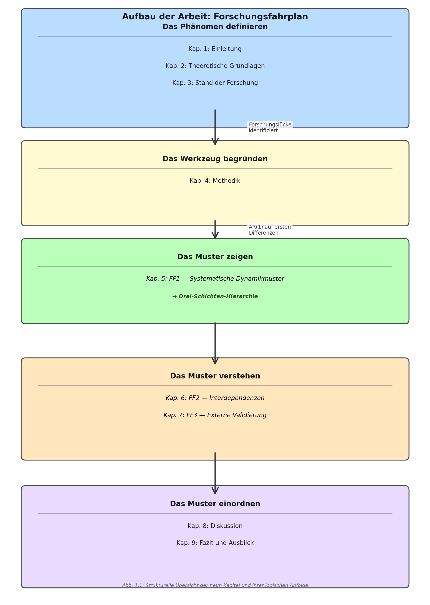 
**Abb. 1.1** — Aufbau der Arbeit · `Finale_Kapitel/Kapitel_1_Grafiken/abb_1_1_aufbau.png`

## Tabellen

— keine —

## Textquellen

| Datei | Status |
|---|---|
| `Finale_Kapitel/Kapitel_1_Einleitung.md` | grober AI-Entwurf, muss ausformuliert werden |

---

# Kap. 2 — Theoretische Fundierung und Forschungsstand

**Status:** ⚠️ Notizen vorhanden, Text zu großen Teilen fehlt. Theorie + Stand der Forschung wurden im Renumber zusammengezogen.

**Inhaltsskelett:** 2.1 Finanzkennzahlen als ökonomisches Messsystem · 2.2 Mean-Reversion · 2.3 AR-Modelle für Panel-Zeitreihen · 2.4 Querschnittliche Differenzierung (Größe, Branche, Typologie) · 2.5 Forschungsbeitrag · 2.x Integrations-Staging Altes Kap. 3.

## Grafiken — aus altem Kap. 2 (Theorie)

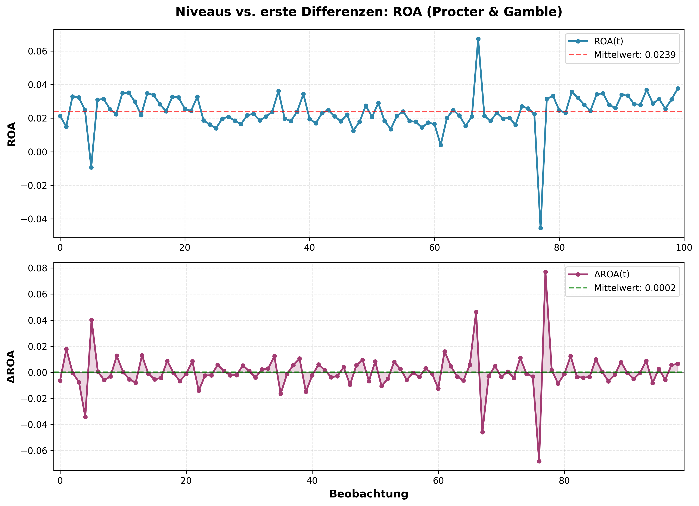 
**Abb. 2.1** — Niveaus vs. Differenzen · `Finale_Kapitel/Kapitel_2_Grafiken/abb_2_1_niveaus_vs_differenzen.png`

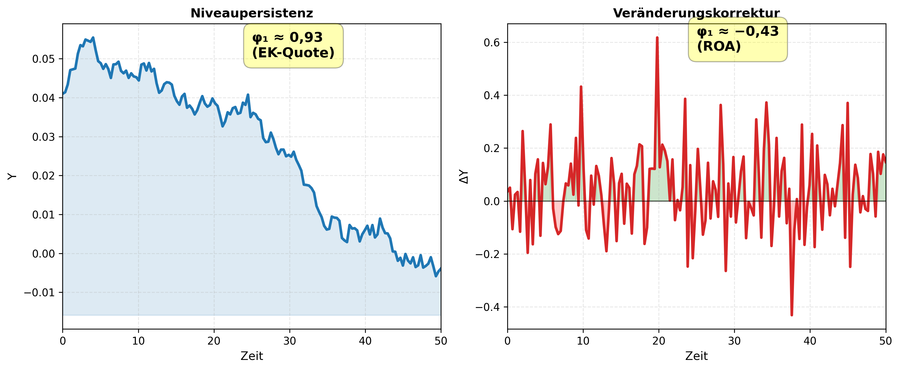 
**Abb. 2.2** — Mean-Reversion-Konzept · `Finale_Kapitel/Kapitel_2_Grafiken/abb_2_2_mean_reversion_konzept.png`

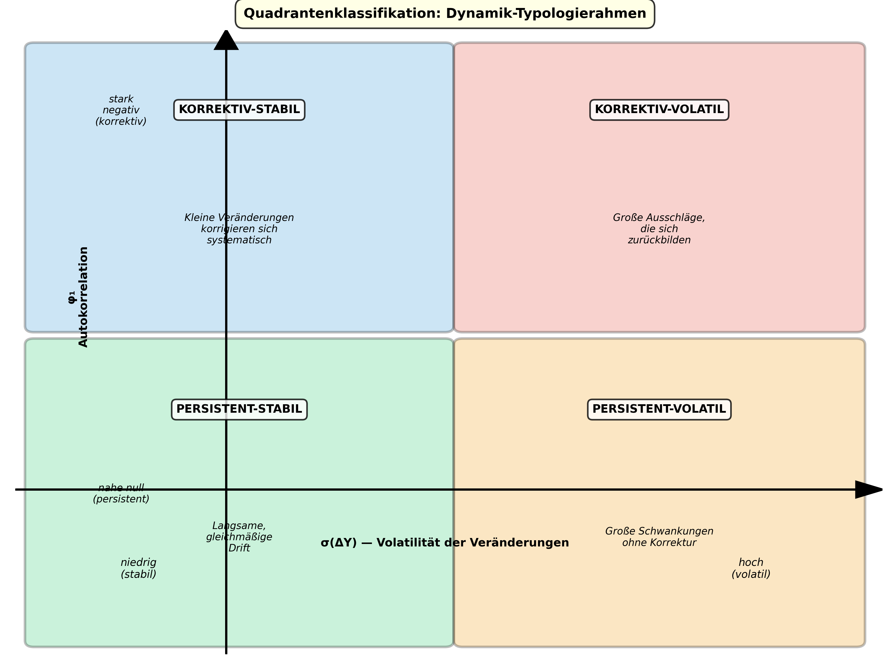 
**Abb. 2.3** — Quadrantenschema · `Finale_Kapitel/Kapitel_2_Grafiken/abb_2_3_quadrantenschema.png`

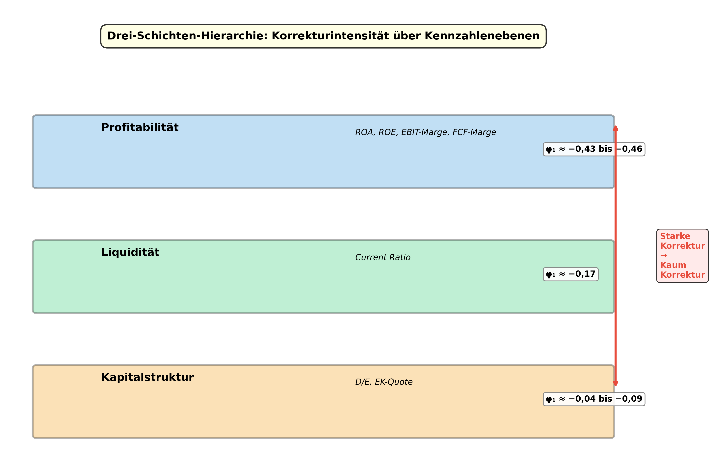 
**Abb. 2.4** — Drei-Schichten-Hierarchie (Theorie-Abriss) · `Finale_Kapitel/Kapitel_2_Grafiken/abb_2_4_drei_schichten.png`

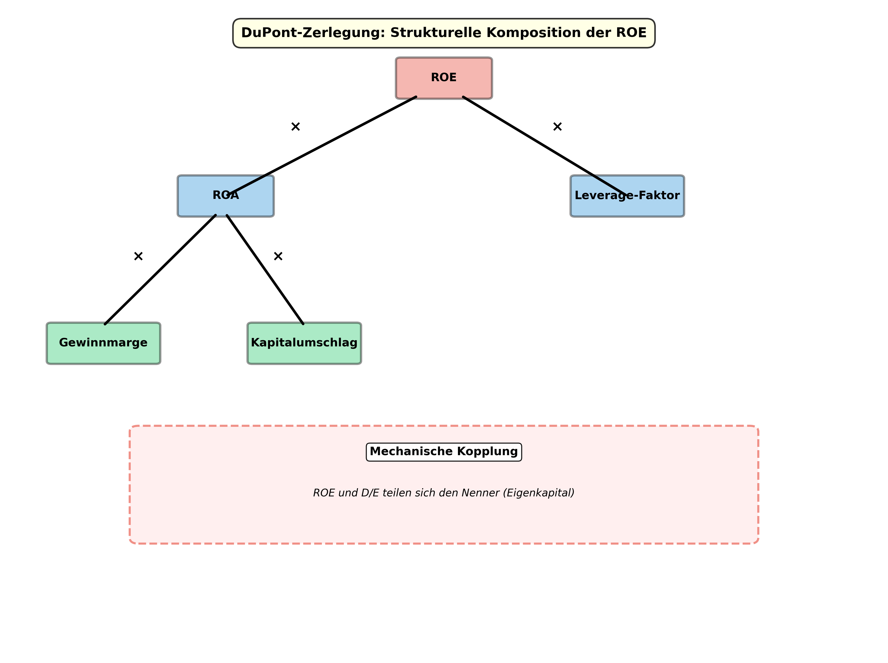 
**Abb. 2.5** — DuPont-Zerlegung · `Finale_Kapitel/Kapitel_2_Grafiken/abb_2_5_dupont_zerlegung.png`

## Grafiken — aus altem Kap. 3 (Forschungsstand, nun Teil von 2.x)

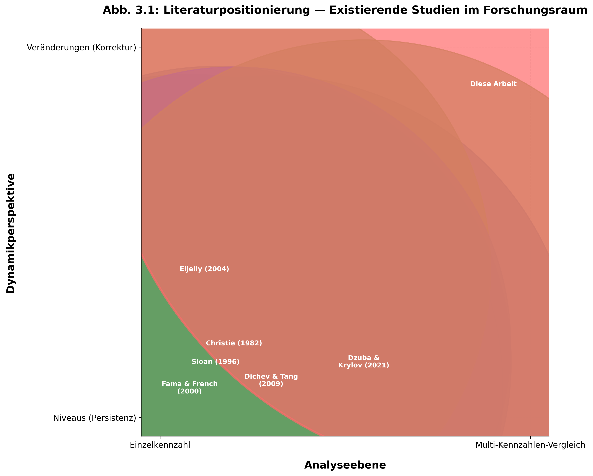 
**Abb. (Lit-Positionierung)** — Literaturpositionierung · `Finale_Kapitel/Kapitel_3_Grafiken/abb_3_1_literaturpositionierung.png`

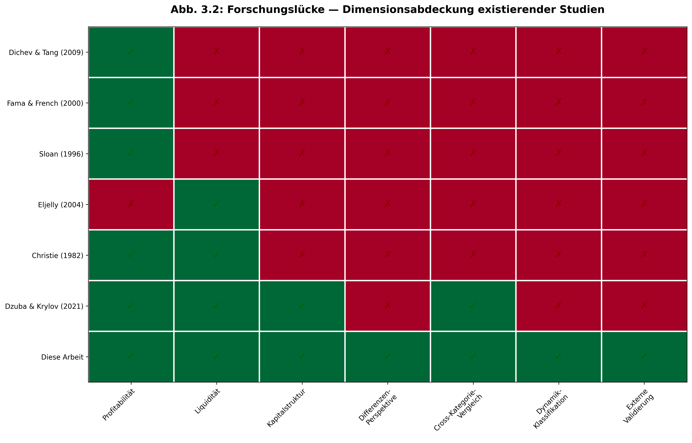 
**Abb. (Forschungslücke)** — `Finale_Kapitel/Kapitel_3_Grafiken/abb_3_2_forschungsluecke.png`

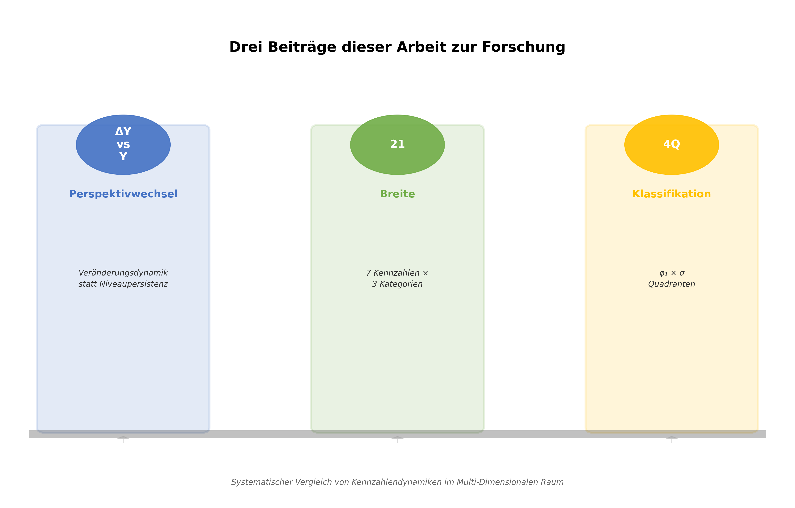 
**Abb. (Beitrag)** — `Finale_Kapitel/Kapitel_3_Grafiken/abb_3_3_beitrag.png`

## Tabellen

— keine direkten — definitorische Tabellen (z.B. „7 Kennzahlen + Formeln") werden in der Schreibphase frei in Word erstellt.

## Textquellen

| Datei | Status |
|---|---|
| `Finale_Kapitel/Kapitel_2_Theoretische_Grundlagen.md` | grober AI-Entwurf |
| `Finale_Kapitel/Kapitel_3_Stand_der_Forschung.md` | grober AI-Entwurf |
| Notizen in `COWORK_KONTEXT.md` (Kap. 2.2.3 / 2.3.1 / 2.3.3) | Stichpunkte, müssen ausformuliert werden |
| Lehrbücher in `Literatur/` (Hamilton, Wooldridge — beschaffen) | siehe `MASTER_REFERENZ.md` §Literatur |

---

# Kap. 3 — Methodik

**Status:** ✅ WEITGEHEND FERTIG laut COWORK_KONTEXT — aber: kleinere Korrekturen offen (TODO-Note 4.2.3, Cramér-V-Reste, Tab.-Farben, Bonferroni-Erwähnung).

**Inhaltsskelett:** 3.1 Datengrundlage · 3.2 Modellspezifikation · 3.3 Quadrantenklassifikation · 3.4 Robustheitsdesign · 3.5 Statistische Auswertungsstrategie.

## Grafiken — aus altem Kap. 4 (Methodik)

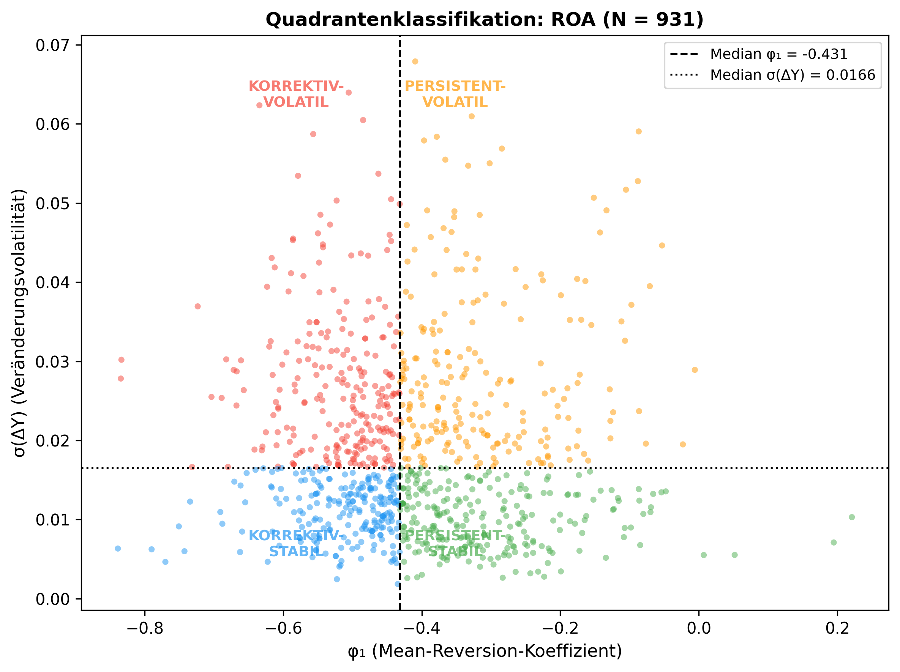 
**Abb. 3.1** (Datei alt: `abb_4_1`) — ROA-Quadranten-Scatterplot · `Finale_Kapitel/Kapitel_4_Grafiken/abb_4_1_roa_quadrant.png` · ⚠️ zweite Medianlinie laut COWORK_KONTEXT noch nicht eingebaut.

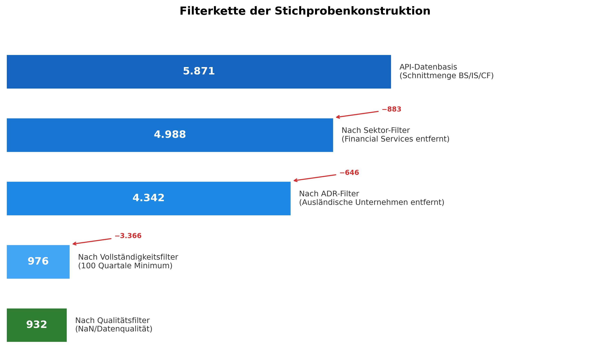 
**Abb. 3.2** — Filterkette von 5871 → 932 Unternehmen · `Finale_Kapitel/Kapitel_4_Grafiken/abb_4_2_filterkette.png`

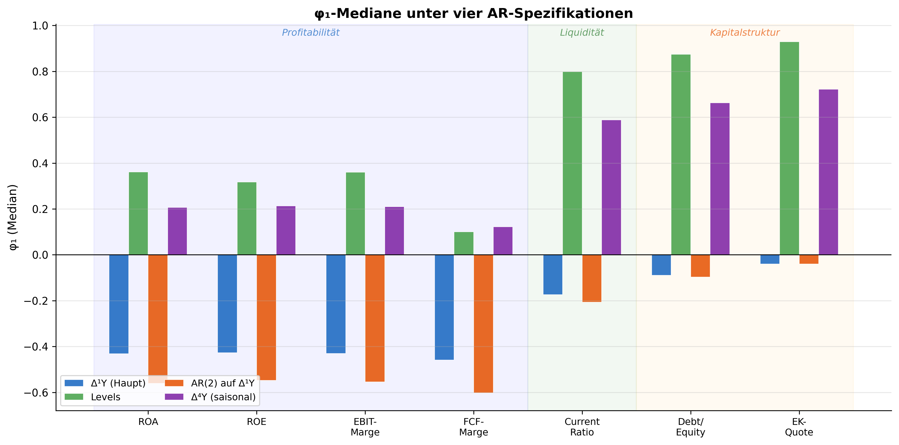 
**Abb. 3.3** — Modellvergleich diff1/levels/AR(2)/Δ4 · `Finale_Kapitel/Kapitel_4_Grafiken/abb_4_3_modellvergleich.png`

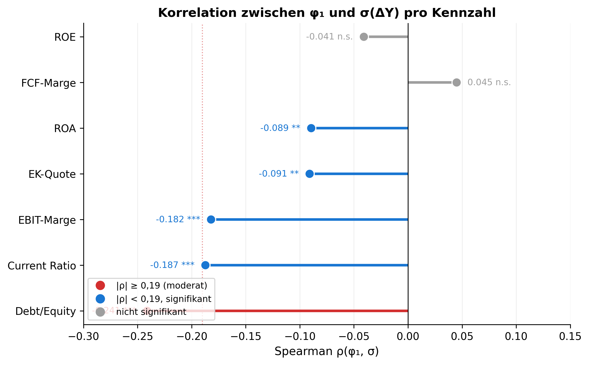 
**Abb. 3.4** — φ₁ × σ-Korrelation (Trennbarkeit) · `Finale_Kapitel/Kapitel_4_Grafiken/abb_4_4_phi1_sigma_korrelation.png`

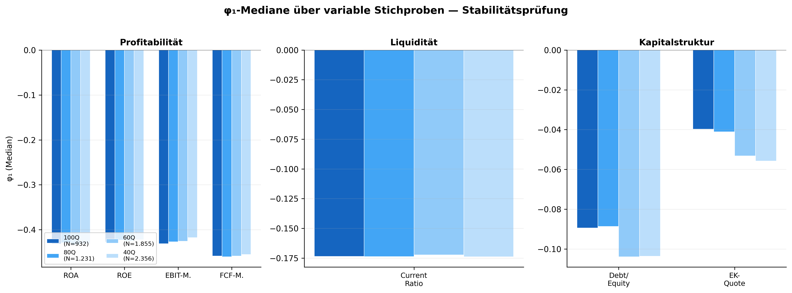 
**Abb. 3.5** — Stichproben-Stabilität (40Q–100Q) · `Finale_Kapitel/Kapitel_4_Grafiken/abb_4_5_stichproben_stabilitaet.png`

## Tabellen

| Tabelle | Quelle (CSV) | Inhalt |
|---|---|---|
| Tab. 3.1 (Stichprobe) | aus `data/` zusammengestellt | 932 Unternehmen, S&P Composite 1500, Q1/2000–Q4/2024 |
| Tab. 3.2 (Modellvarianten) | `output/ar/ar_summary_by_model_ratio.csv` | 4 Modelle × 7 Kennzahlen |
| Tab. 3.3 (Quadranten-Definition) | hardcoded — siehe Methodik-Text | 4 Dynamiktypen, Median-Split |

## Textquellen

| Datei | Status |
|---|---|
| `Text/Kapitel_4_Methodik.docx` | aktuelles Methodik-Dokument (alte Bezeichnung im Dateinamen) |
| `Finale_Kapitel/Kapitel_4_Methodik.md` | grober AI-Entwurf, ergänzend |
| `Text/Arbeitstext.docx` Kap. 3 | Scaffold mit Sub-Sektionen |

---

# Kap. 4 — Ergebnisse FF1: Systematische Dynamikmuster

**Status:** ⚠️ Gliederung steht, Fließtext fehlt, große Teile aber als Vorlage in `output/FF1_Ergebnisse.docx`.

**Inhaltsskelett:** 4.1 Analyse nach Kennzahl · 4.2 Analyse nach Branche · 4.3 Interpretation · 4.4 Erkenntnisse · 4.5 Robustheit.

## Grafiken — aus altem Kap. 5 (FF1)

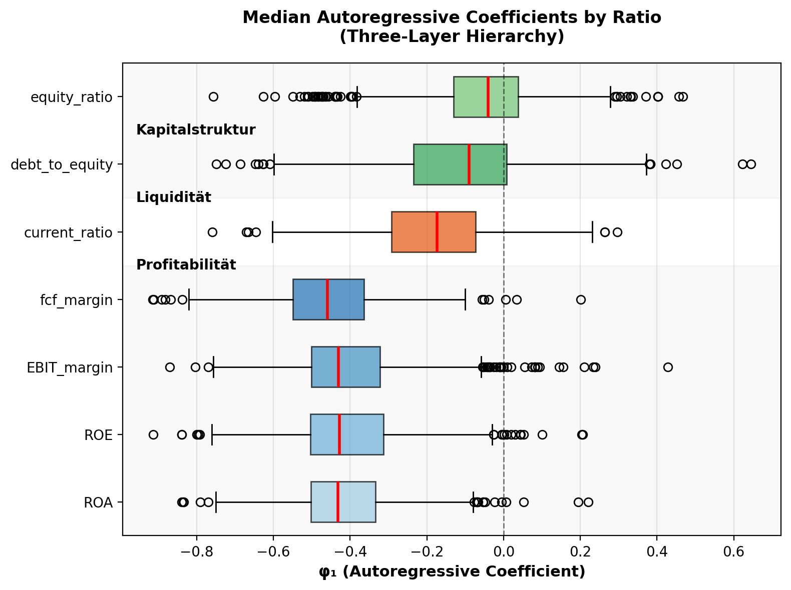 
**Abb. 4.1** (Datei: `abb_5_1`) — Drei-Schichten-Boxplots der φ₁-Verteilung · `Finale_Kapitel/Kapitel_5_Grafiken/abb_5_1_drei_schichten_boxplots.png`

 
**Abb. 4.2** — Signifikanzraten und R²-Verteilung · `Finale_Kapitel/Kapitel_5_Grafiken/abb_5_2_signifikanz_r2.png`

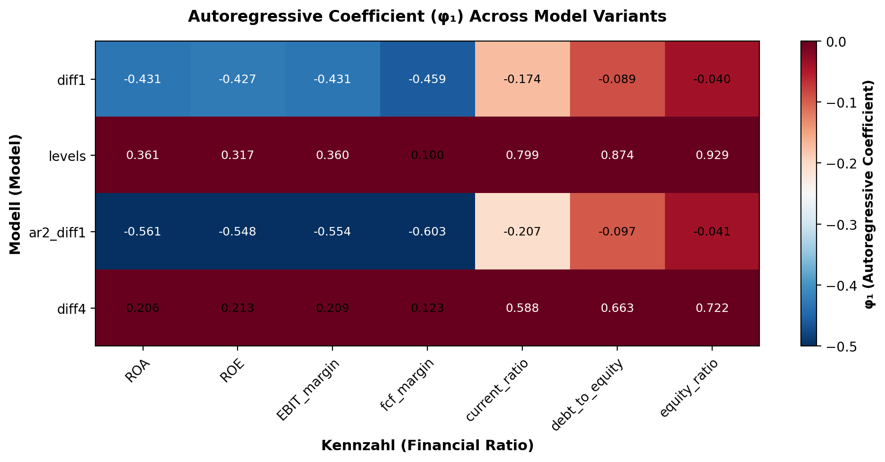 
**Abb. 4.3** — Modellvergleich-Tabelle (φ₁-Mediane über 4 Varianten) · `Finale_Kapitel/Kapitel_5_Grafiken/abb_5_3_modellvergleich_tabelle.png`

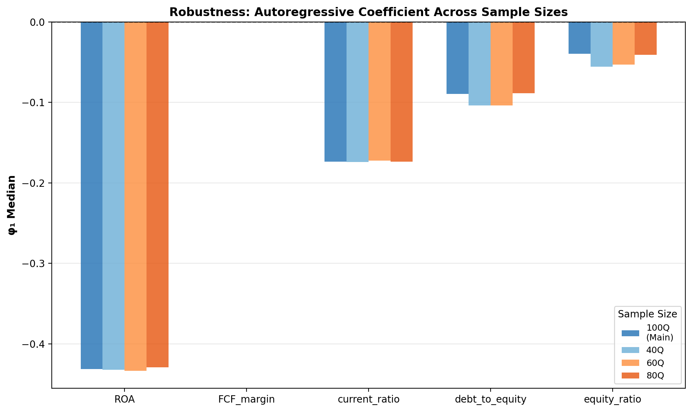 
**Abb. 4.4** — Stichprobenrobustheit (40Q/60Q/80Q/100Q) · `Finale_Kapitel/Kapitel_5_Grafiken/abb_5_4_stichproben_robustheit.png`

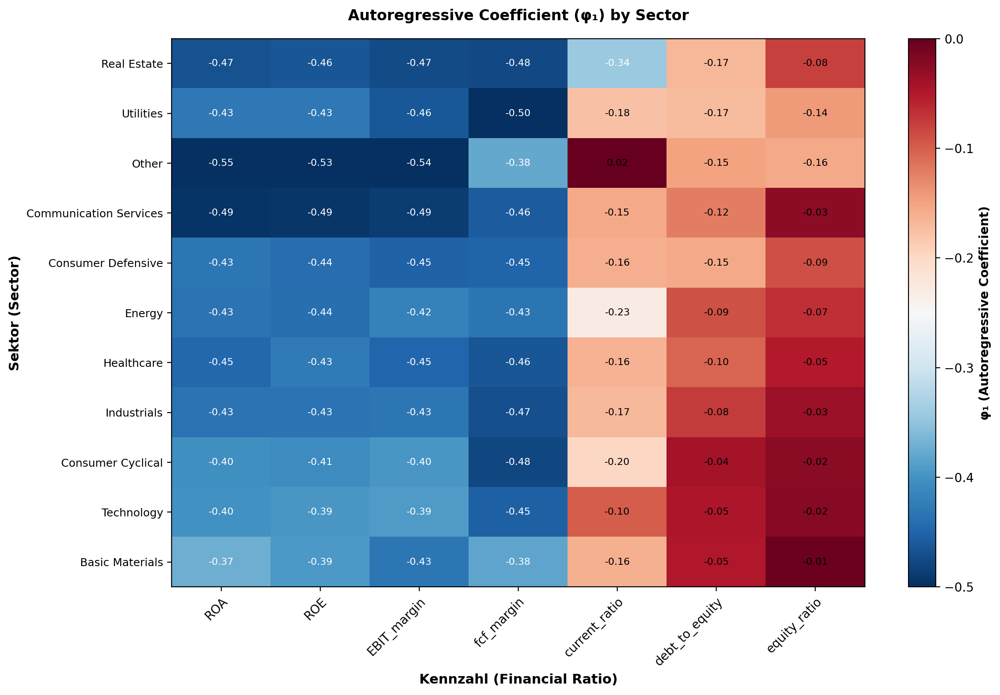 
**Abb. 4.5** — Sektor-Heatmap φ₁ (10 Sektoren × 7 Kennzahlen) · `Finale_Kapitel/Kapitel_5_Grafiken/abb_5_5_sektor_heatmap.png`

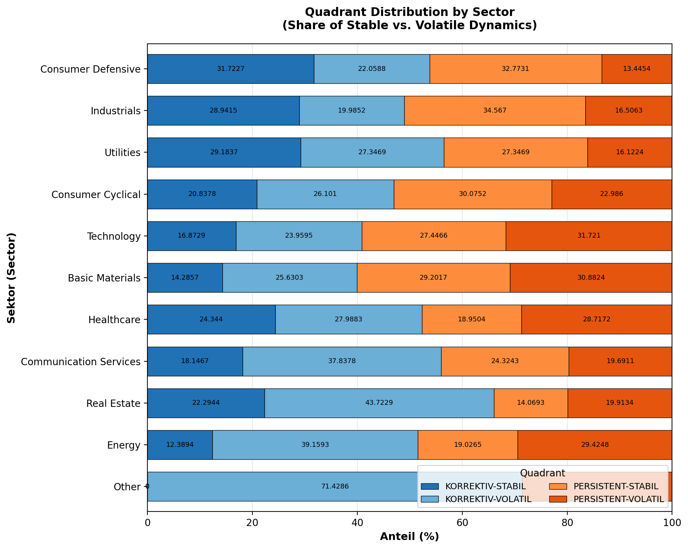 
**Abb. 4.6** — Sektor-Quadrantenverteilung · `Finale_Kapitel/Kapitel_5_Grafiken/abb_5_6_sektor_quadranten.png`

### Ergänzende Sektor-Detail-Plots (`output/plots/sectors/`)

11 individuelle φ₁-Verteilungen pro Sektor, Boxplot/Histogramm-Kombination — nützlich als Anhang oder als Detail-Referenz für die Sektor-Erzählung in 4.4.

| Sektor | Pfad |
|---|---|
| Industrials | `output/plots/sectors/ff1_phi1_dist_industrials.png` |
| Consumer Cyclical | `output/plots/sectors/ff1_phi1_dist_consumer_cyclical.png` |
| Technology | `output/plots/sectors/ff1_phi1_dist_technology.png` |
| Healthcare | `output/plots/sectors/ff1_phi1_dist_healthcare.png` |
| Utilities | `output/plots/sectors/ff1_phi1_dist_utilities.png` |
| Consumer Defensive | `output/plots/sectors/ff1_phi1_dist_consumer_defensive.png` |
| Basic Materials | `output/plots/sectors/ff1_phi1_dist_basic_materials.png` |
| Real Estate | `output/plots/sectors/ff1_phi1_dist_real_estate.png` |
| Energy | `output/plots/sectors/ff1_phi1_dist_energy.png` |
| Communication Services | `output/plots/sectors/ff1_phi1_dist_communication_services.png` |
| Other | `output/plots/sectors/ff1_phi1_dist_other.png` |

## Tabellen

| Tabelle | Quelle (CSV) | Inhalt |
|---|---|---|
| Tab. 4.1 — Drei-Schichten-Hierarchie | `output/ar/ar_summary_by_ratio.csv` | φ₁/σ/Signifikanz/Halblebensdauer pro Kennzahl. ⭐ Mit den E5.4-Erweiterungen `hl_quarters_tau` und `hl_years_tau` |
| Tab. 4.2 — IQR/Perzentile pro Kennzahl | aus `output/ar/ar_features_all.csv` aggregiert | 7×4-Tabellen je Kennzahl, fertig in `FF1_Ergebnisse.docx` Sektion 3 |
| Tab. 4.3 — Sektor × φ₁-Median | bereits gerendert in `FF1_Ergebnisse.docx` Tab. 2 (11×8) | Sektor-Hauptergebnis |
| Tab. 4.4 — Trennbarkeit Quadrantendimensionen | `output/ar/phi1_sigma_correlation.csv` | Spearman φ₁×σ pro Kennzahl |
| Tab. 4.5 — Modellvergleich | `output/ar/ar_summary_by_model_ratio.csv` | 4 Modellvarianten × 7 Kennzahlen |
| Tab. 4.6 — Stichprobenrobustheit | `output/robustness/sample_comparison.csv` | 40Q/60Q/80Q/100Q |

## Textquellen

| Datei | Wofür | Status |
|---|---|---|
| `output/FF1_Ergebnisse.docx` | **Hauptquelle.** Sektionen 2 (Sektor-Übersicht), 3 (Pro-Kennzahl), 4 (Drei-Schichten-Synthese), **5 (10 Sektor-Profile, ausformuliert)**, 6 (Modellvergleich), 7 (Stichproben-Robustheit) | direkt portierbar in Kap. 4 |
| `output/FF1_Interpretation_AR1_Diffs.md` | gleiche Inhalte als MD | redundant zu DOCX |
| `Finale_Kapitel/Kapitel_5_FF1_Ergebnisse.md` | grober AI-Entwurf | weniger detailliert als FF1_Ergebnisse.docx |
| `Text/FF1_UEBERSICHT.md` | FF1-Navigationskarte | Lese-Referenz |

---

# Kap. 5 — Ergebnisse FF2: Interdependenzen und zeitliche Manifestation

**Status:** ⚠️ Gliederung steht, Fließtext fehlt. Vorlage in `output/FF2_Ergebnisse.docx` — Cramér-V-Sektion 2.3 muss raus (F5 / Stollhoff E11).

**Inhaltsskelett:** 5.1 Querschnittliche Interdependenz · 5.2 Zeitliche Manifestation: Event-Analyse · 5.3 Interpretation · 5.4 Erkenntnisse · 5.5 Robustheit.

## Grafiken — aus altem Kap. 6 (FF2)

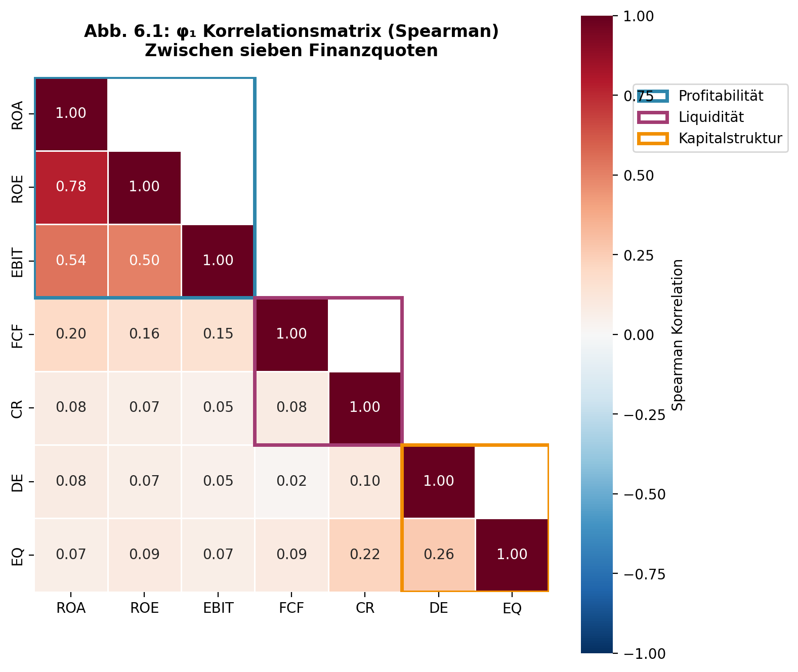 
**Abb. 5.1** (Datei: `abb_6_1`) — φ₁-Korrelationsmatrix (Heatmap) · `Finale_Kapitel/Kapitel_6_Grafiken/abb_6_1_phi1_korrelationsmatrix.png`

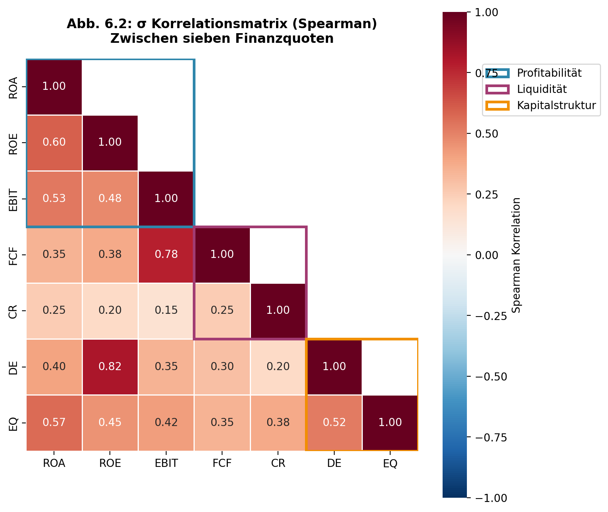 
**Abb. 5.2** — σ-Korrelationsmatrix (Heatmap) · `Finale_Kapitel/Kapitel_6_Grafiken/abb_6_2_sigma_korrelationsmatrix.png`

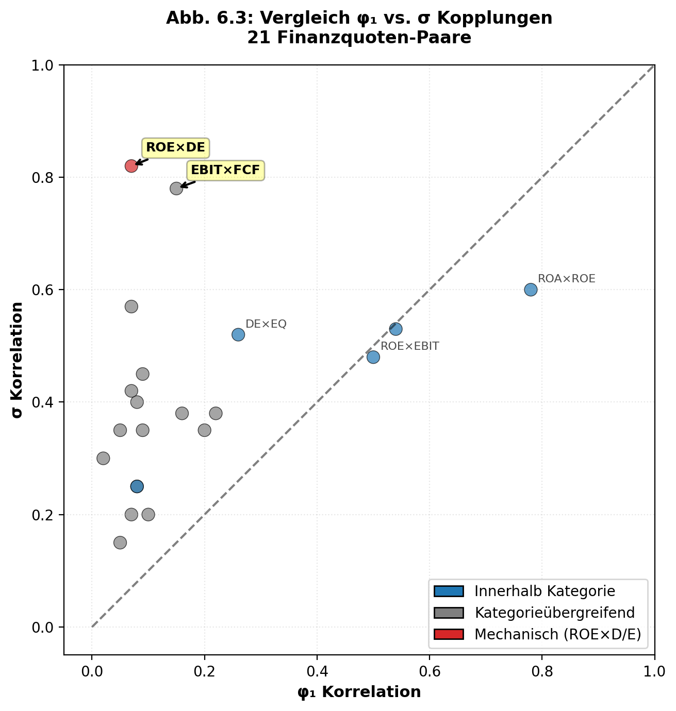 
**Abb. 5.3** — φ₁ vs. σ Vergleich (zwei Informationsdimensionen) · `Finale_Kapitel/Kapitel_6_Grafiken/abb_6_3_phi1_vs_sigma_vergleich.png`

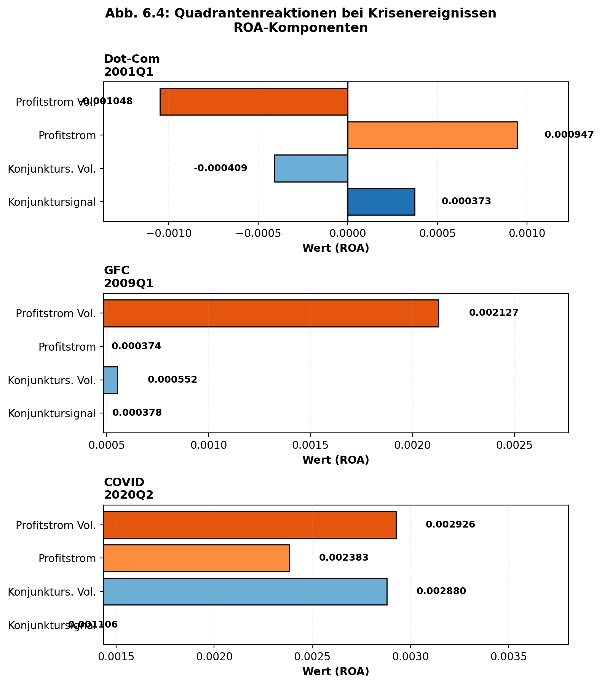 
**Abb. 5.4** — Event-Reaktionen pro Quadrant · `Finale_Kapitel/Kapitel_6_Grafiken/abb_6_4_event_reaktionen.png`

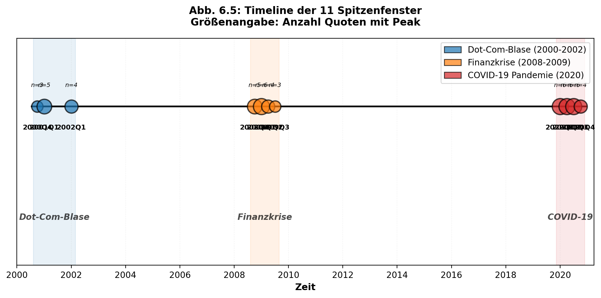 
**Abb. 5.5** — Event-Timeline (Volatilitäts-Peaks 2000–2024) · `Finale_Kapitel/Kapitel_6_Grafiken/abb_6_5_event_timeline.png`

### Alternative/zusätzliche Plots in `output/plots/`

- `output/plots/ff2_corr_phi1_heatmap.png` und `_v2.png` (Heatmap-Varianten)
- `output/plots/ff2_corr_sigma_heatmap.png` und `_v2.png`
- `output/plots/ff2_quadrant_reactions.png` (Quadranten-Reaktionsmuster)
- `output/plots/ff2_sector_reactions.png`
- `output/plots/ff2_sig_tests_heatmap.png` (Heatmap signifikanter Tests)
- `output/plots/ff2_volatility_timeline.png`
- ⚠️ `output/plots/ff2_cramers_v_overview.png` — **NICHT MEHR VERWENDEN** (Stollhoff E11)

## Tabellen

| Tabelle | Quelle | Inhalt |
|---|---|---|
| Tab. 5.1 — φ₁-Korrelationsmatrix (7×7) | `output/interdependence/corr_phi1.csv` | Spearman-Korrelation der φ₁-Werte |
| Tab. 5.2 — σ-Korrelationsmatrix (7×7) | `output/interdependence/corr_sigma.csv` | Spearman-Korrelation der σ-Werte |
| Tab. 5.3 — p-Werte φ₁ + Bonferroni | `output/interdependence/pval_phi1.csv` und `pval_phi1_long.csv` | ⭐ Long-Form mit `significant_05` und `significant_bonferroni` (E6.5, α=0.00119) |
| Tab. 5.4 — p-Werte σ + Bonferroni | `output/interdependence/pval_sigma.csv` und `pval_sigma_long.csv` | gleich für σ |
| Tab. 5.5 — Bonferroni-Mirror-Matrix φ₁ | `output/interdependence/sig_bonferroni_phi1.csv` | symmetrische Bool-Matrix |
| Tab. 5.6 — Bonferroni-Mirror-Matrix σ | `output/interdependence/sig_bonferroni_sigma.csv` | symmetrische Bool-Matrix |
| Tab. 5.7 — Peak-Windows | `output/explore/peak_windows.csv` | Krisenquartale (Dot-Com, GFC, COVID) |
| Tab. 5.8 — Querschnittsvolatilität | `output/explore/volatility_scores.csv` | rollierende σ pro Quartal |

## Textquellen

| Datei | Wofür | Status |
|---|---|---|
| `output/FF2_Ergebnisse.docx` | Hauptquelle. Sektionen 1, 2.1, 2.2, 2.4, 3.1–3.5 übernehmbar | direkt portierbar |
| Sektion 2.3 in derselben DOCX (Cramér's V) | **NICHT übernehmen** (F5) | streichen |
| `output/FF2_Interdependenz_Events.md` | gleiche Inhalte als MD | redundant zu DOCX |
| `Finale_Kapitel/Kapitel_6_FF2_Interdependenzen.md` | grober AI-Entwurf | weniger detailliert |

---

# Kap. 6 — Ergebnisse FF3: Externe Validierung der Dynamikprofile

**Status:** ⚠️ Gliederung steht, Fließtext fehlt. Vorlage in `output/FF3_Ergebnisse.docx` ist **fast 1:1 übernehmbar**.

**Inhaltsskelett:** 6.1 Konsistenz · 6.2 Externe Merkmale (Branche + Größe) · 6.3 K-Means · 6.4 Financial Services · 6.5 Erkenntnisse · 6.6 Robustheit.

## Grafiken — aus altem Kap. 7 (FF3)

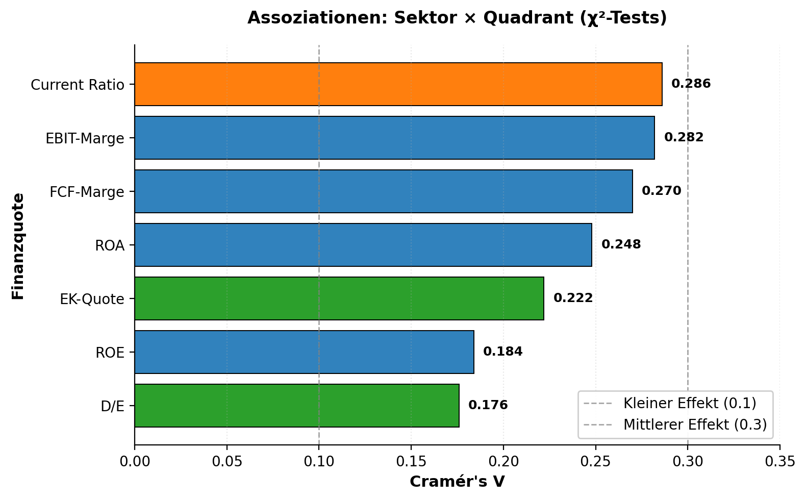 
**Abb. 6.1** (Datei: `abb_7_1`) — χ²-Tests + Cramér's V (Sektor × Quadrant) · `Finale_Kapitel/Kapitel_7_Grafiken/abb_7_1_chi2_cramers_v.png` · ✅ Cramér's V hier ist **richtig** (Stollhoff E11: nur in FF3 erlaubt)

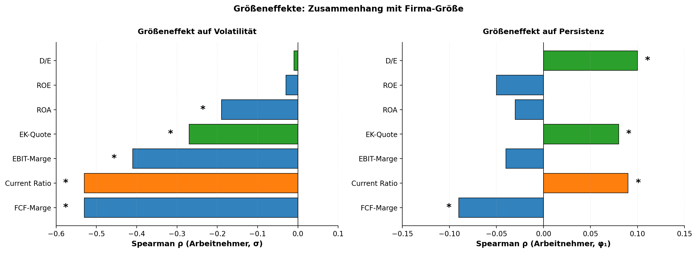 
**Abb. 6.2** — Größeneffekte (MarketCap/Employees × φ₁ und σ) · `Finale_Kapitel/Kapitel_7_Grafiken/abb_7_2_groesseneffekte.png`

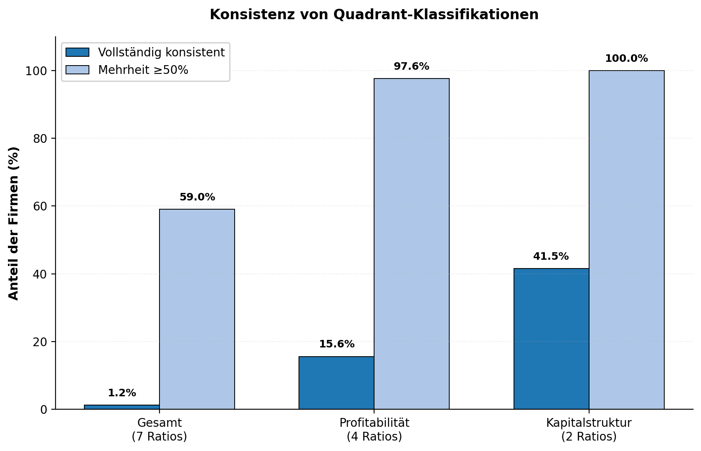 
**Abb. 6.3** — Konsistenz-Histogramm/Layer-Konsistenz · `Finale_Kapitel/Kapitel_7_Grafiken/abb_7_3_konsistenz.png`

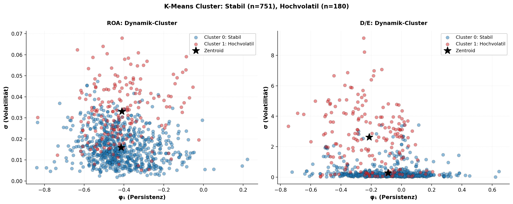 
**Abb. 6.4** — K-Means-Cluster-Profile · `Finale_Kapitel/Kapitel_7_Grafiken/abb_7_4_kmeans_cluster.png`

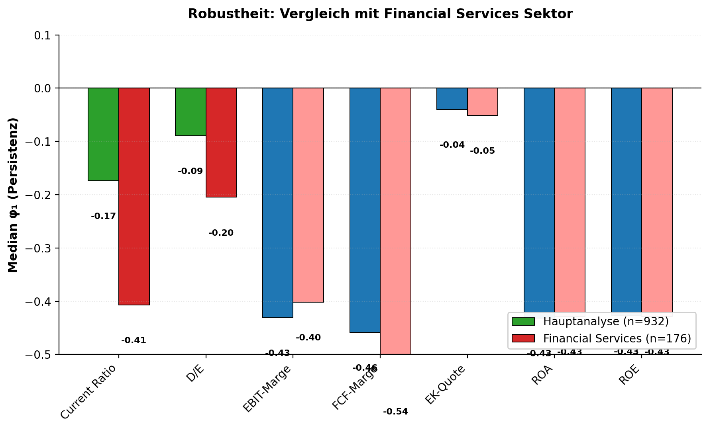 
**Abb. 6.5** — Financial-Services-Vergleich · `Finale_Kapitel/Kapitel_7_Grafiken/abb_7_5_finserv_vergleich.png`

### Alternative/zusätzliche Plots in `output/plots/`

- `output/plots/ff3_chi2_cramers_v.png`
- `output/plots/ff3_consistency_histogram.png`
- `output/plots/ff3_dominant_quadrants.png`
- `output/plots/ff3_finserv_comparison.png` und `_v2.png`
- `output/plots/ff3_kmeans_profiles.png`
- `output/plots/ff3_layer_consistency.png`
- `output/plots/ff3_sector_quadrant_heatmap.png`
- `output/plots/ff3_size_effects.png`

## Tabellen

| Tabelle | Quelle | Inhalt |
|---|---|---|
| Tab. 6.1 — Konsistenz-Scores | `output/profiles/consistency_summary.csv` | 1,2% / 97,6% / Schichtebenen |
| Tab. 6.2 — Dominante Quadranten | `output/profiles/company_quadrant_profiles.csv` | PERSISTENT-STABIL 30,2% etc. |
| Tab. 6.3 — χ²-Tests Sektor × Quadrant | `output/profiles/ff3_chi2_results.csv` | ⭐ Inkl. neue Spalte `significant_bonferroni` (E7.5, α=0.00714) — alle 7/7 bestehen |
| Tab. 6.4 — Größeneffekte (Spearman) | `output/profiles/ff3_size_effects.csv` | MarketCap/Employees × φ₁/σ pro Kennzahl |
| Tab. 6.5 — K-Means-Cluster-Profile | `output/clustering/kmeans_ar_dynamics_labels.csv` und `_diagnostics.csv` | Cluster 0 (81%) vs. Cluster 1 (19%) |
| Tab. 6.6 — FinServ-Vergleich | `output/robustness/financial_services.csv` | Hauptanalyse vs. FinServ pro Kennzahl |

## Textquellen

| Datei | Wofür | Status |
|---|---|---|
| `output/FF3_Ergebnisse.docx` | **Hauptquelle.** Alle 7 Sektionen übernehmbar | fast 1:1 portierbar |
| `output/FF3_Externe_Validierung.md` | gleiche Inhalte als MD | redundant zu DOCX |
| `Finale_Kapitel/Kapitel_7_FF3_Externe_Validierung.md` | grober AI-Entwurf | weniger detailliert |
| `output/profiles/ff3_summary.md` | Kurzfassung | als Querverweis |

---

# Kap. 7 — Diskussion

**Status:** ❌ NICHT GESCHRIEBEN. Stollhoff: „Interpretation ist das, was noch fehlt." Steglich bewertet das besonders.

**Inhaltsskelett:** 7.1 Ökonomische Interpretation · 7.2 Einordnung in die Literatur · 7.3 Limitationen · 7.4 Praktische Implikationen.

**Konzeptueller Anker:** das **Vier-Achsen-Modell** aus dem Cross-Chat-Input (Markt↔Management, Zeitkonstante, Strom↔Bestand, Zähler-Nenner) — landet primär hier in 7.1 und als Echo in der FF1-Interpretation Kap. 4.3.1. → Wird in `Text/INTERPRETATION_4_AXES.md` separat dokumentiert (folgt).

## Grafiken — aus altem Kap. 8 (Diskussion)

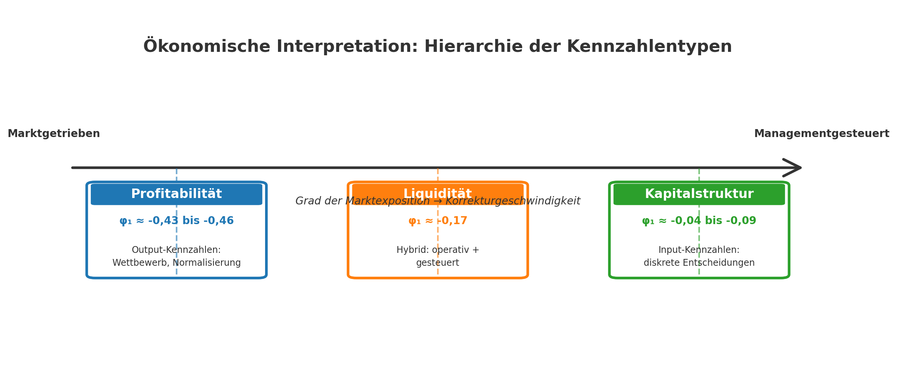 
**Abb. 7.1** (Datei: `abb_8_1`) — Ökonomische Interpretation (Schema) · `Finale_Kapitel/Kapitel_8_Grafiken/abb_8_1_oekonomische_interpretation.png`

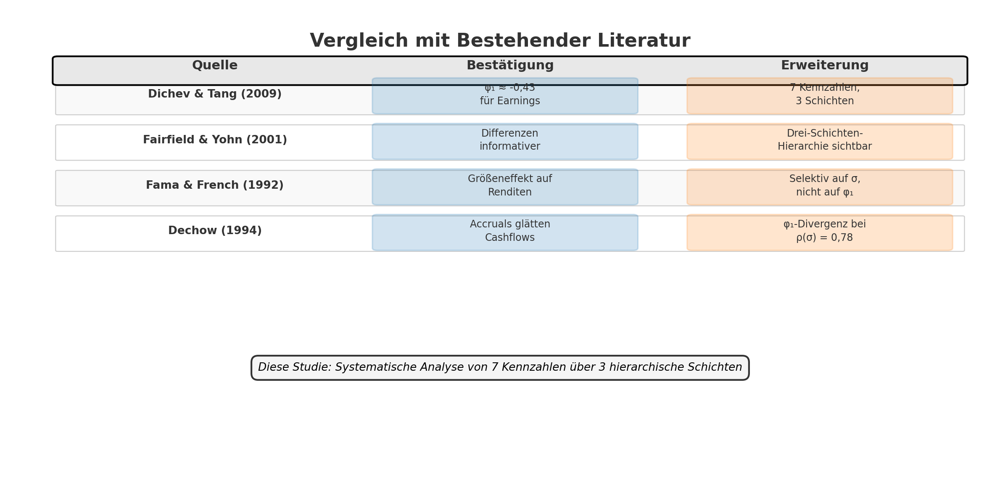 
**Abb. 7.2** — Literaturvergleich (Dichev & Tang etc.) · `Finale_Kapitel/Kapitel_8_Grafiken/abb_8_2_literaturvergleich.png`

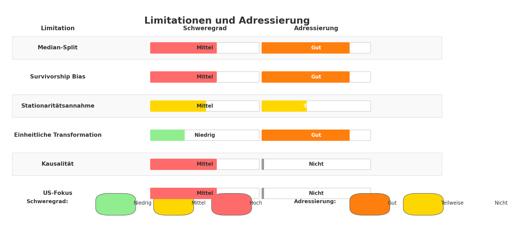 
**Abb. 7.3** — Limitationen-Übersicht · `Finale_Kapitel/Kapitel_8_Grafiken/abb_8_3_limitationen.png`

## Tabellen

| Tabelle | Quelle | Inhalt |
|---|---|---|
| Tab. 7.1 — Eigene Befunde vs. Dichev & Tang (2009) | manuell erstellen | exakte φ₁-Vergleichszahlen |
| Tab. 7.2 — Limitationen-Matrix | manuell erstellen | sechs Limitationen aus COWORK_KONTEXT §Kap. 7 (alt 8) |

## Textquellen

| Datei | Status |
|---|---|
| `Finale_Kapitel/Kapitel_8_Diskussion.md` | grober AI-Entwurf |
| `output/METHODIK_DISKUSSION.md` | methodische Diskussion, teilweise nutzbar |
| `output/METHODIKENTSCHEIDUNGEN_TIMELINE.md` | historische Methodenentscheidungen, für Limitationen-Argumentation |
| Cross-Chat-Input Vier-Achsen-Modell (siehe `Text/INTERPRETATION_4_AXES.md`, folgt) | aktuell |

---

# Kap. 8 — Fazit und Ausblick

**Status:** ❌ NICHT GESCHRIEBEN — laut Plan nach Kap. 7 schreiben.

**Inhaltsskelett:** 8.1 Zusammenfassung der Ergebnisse · 8.2 Wissenschaftlicher Beitrag · 8.3 Ausblick.

## Grafiken — aus altem Kap. 9 (Fazit)

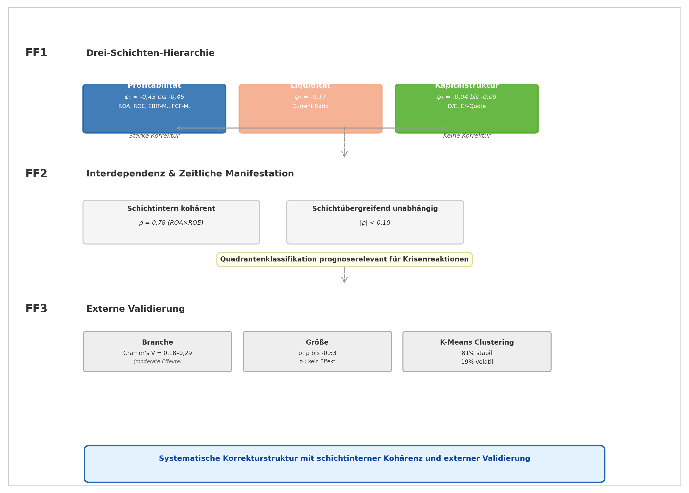 
**Abb. 8.1** (Datei: `abb_9_1`) — Synthese der drei Forschungsfragen · `Finale_Kapitel/Kapitel_9_Grafiken/abb_9_1_synthese.png`

## Tabellen

— keine — Fazit ist Fließtext.

## Textquellen

| Datei | Status |
|---|---|
| `Finale_Kapitel/Kapitel_9_Fazit.md` | grober AI-Entwurf |
| `eu_data_fetch/` | Verteidigungs-Reserve, NICHT im Fazit erwähnen (gemäß Stollhoff E13) |

---

# Globale Quer-Referenzen

| Datei | Wofür |
|---|---|
| `Text/MASTER_REFERENZ.md` | Single Source of Truth für Kapitelstand, Prof-Absprachen, Quellenlandkarte |
| `Text/GLIEDERUNG_MASTERARBEIT.md` | 77-KB-Schreibplan pro Kapitel |
| `Text/FF1_UEBERSICHT.md` | FF1-Navigation, 4 zusätzliche Figurvorschläge |
| `Text/PROJECT_STATUS.md` und `GESAMTPLAN_APRIL_2026.md` | Zeitplan |
| `COWORK_KONTEXT.md` | lebendes Session-Briefing |
| `ERWEITERUNGSPOTENZIALE.md` | E5–E8 Erweiterungs-Backlog |
| `Literatur/` | PDFs der zitierten Quellen (10 vorhanden, 4 zu beschaffen — siehe MASTER_REFERENZ §Quellen) |

---

*Stand 25.04.2026 — bei substanziellen Änderungen an Grafiken/Tabellen/Texten bitte hier nachziehen, sonst veraltet die Karte.*
